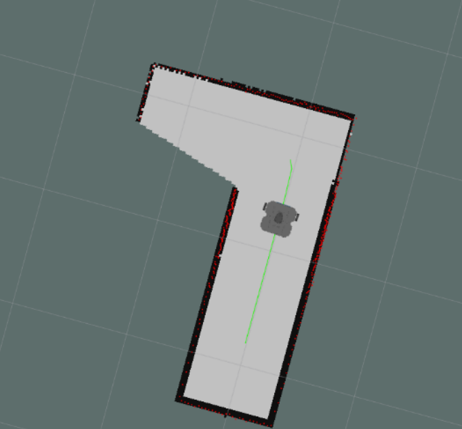

# ROS Autonomous Navigation, Mapping and Exploration
[](http://wiki.ros.org)
[](https://isocpp.org)
[](https://opensource.org/licenses/MIT)

Developed a ROS1 navigation stack for autonomous robots, including LiDAR-based mapping (SLAM component), global path planning with A, Bézier smoothing, PID path following, and frontier-based exploration.
<p align="center">
  
</p>

## Overview
This project implements a **ROS1 (C++) navigation stack** for mobile robots, combining:
- **Mapping (SLAM component)**: Builds an Occupancy Grid from LiDAR scans using TF and Bresenham ray tracing.
- **Global Path Planning**: A* algorithm with obstacle inflation and Bézier curve smoothing.
- **PID Path Following**: Tracks planned paths using odometry feedback.
- **Frontier-Based Exploration**: Detects unexplored areas and autonomously selects new goals.
- **Computer Vision Integration**: Designed to support vision-based perception for future extensions.
- Includes **RViz configs**, **Gazebo worlds**, and **keyboard teleoperation**.

---

## Key Features
- LiDAR-based mapping (part of SLAM pipeline).
- A* planner with obstacle inflation and smooth trajectories.
- PID controller for accurate motion control.
- Autonomous exploration using frontier detection and clustering.

---

## Quick Start
```bash
# Build
mkdir -p ~/proj_ws/src && cd ~/proj_ws/src
git clone https://github.com/<your-user>/<repo-name>.git
cd .. && catkin_make && source devel/setup.bash

# Run mapping
rosrun createmap create_gridmap

# Run planner
rosrun astar_planning astar_planner 

# Run PID follower
rosrun pid_path_follower pid_path_follower_node
